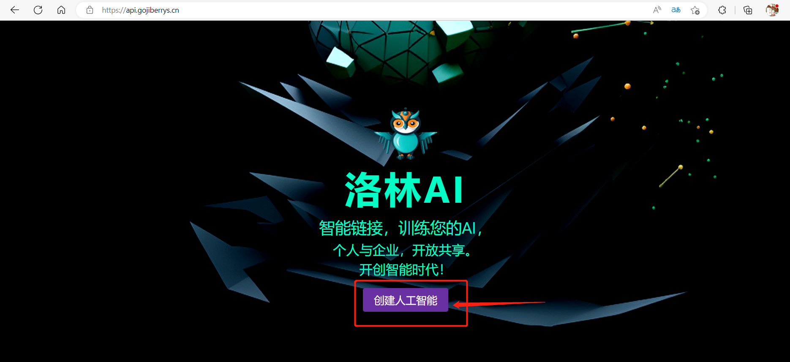
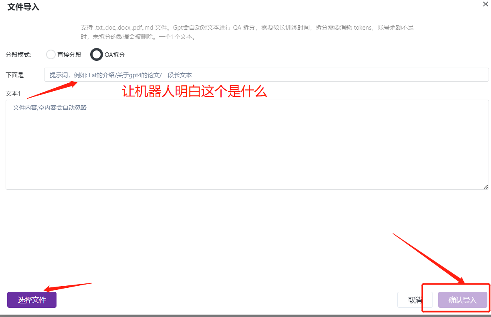
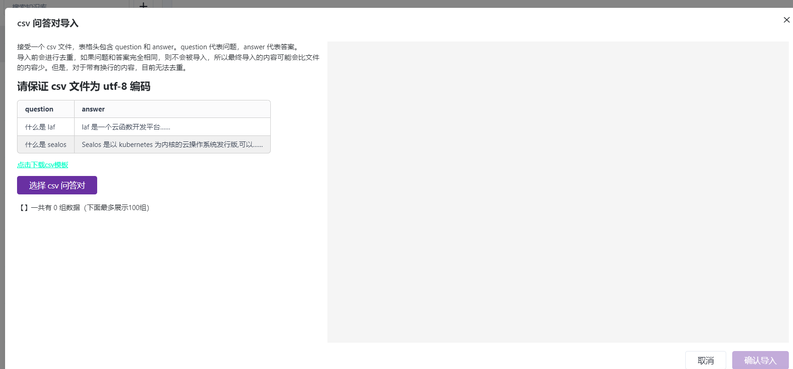

**************基于自己私有化知识库的的微信机器人**************

点此[登录洛林AI知识交互中心网站](https://api.gojiberrys.cn/)
点击创建AI

如何创建知识库，并导入

导入知识之手动方式导入

**文件导入**
支持 .txt,.doc,.docx,.pdf,.md 文件。Gpt会自动对文本进行 QA 拆分，需要较长训练时间，拆分需要消耗
tokens，账号余额不足时，未拆分的数据会被删除。一个1个文本。

**表格导入**
接受一个 csv 文件，表格头包含 question 和 answer。question 代表问题，answer 代表答案。
导入前会进行去重，如果问题和答案完全相同，则不会被导入，所以最终导入的内容可能会比文件的内容少。但是，对于带有换行的内容，目前无法去重。

**以上三种方法都可以，根据自己的需求来选择**

完成以上操作基本之后点击保存，机器人就可以对上传的知识进行训练了，当训练完成后可以回自动显示到训练之后就在知识库中出现了

创建自己的私有化应用，，关联自己相关的知识库

如何获取 api key
开发页，点击添加新的 Api Key 可获取 ，请在获取后保存，后续将无法再获取该 key，只能删除重新生成。

如何取 modelId / appId
V3.8之后的接口改成了 appId 。两者是同一个东西，主要看接口实际字段。
我的应用编辑页内可获取
